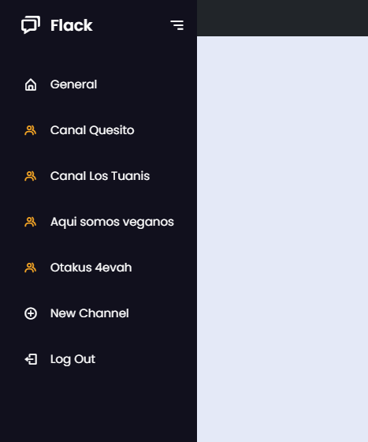
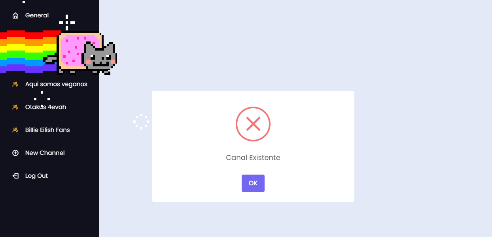

# Project 2 => Flack

## Elaborado por Eduardo Castellón (C^2)

Bienvenido a mi Project2 de WEB50Xni: Flack, es una aplicación web construida en Flask y JavaScript usando SocketIO que te permite chatear con tus amigos en canales de chat, crear canales y mucho mas! Ven, pruebala!

## Estructura - Funcionalidad - Descripción

### Scripts

Para le ejecución de éste proyecto únicamente se utilizan los siguientes scripts:

#### Python:
- app.py: Script python en flask donde se tiene la aplicación principal

#### JavaScript:
- index.js: Archivo JS donde se encuentra toda la lógica referente a la conexión con el socket y el envío de mensajes desde front-end

#### HTML: 
- Layout: HTML que renderiza la plantilla Index en su interior que contiene las referencias de todos los estilos CSS y Scripts JS
- Login: HTML independiente para iniciar sesión
- Index: HTML principal donde están las vistas de las funcionalidades estelares.

#### SCSS:
- chat-styles: Que contienen los estilos para los chats
- login-styles: Que contienen los estilos para el login
- nav-styles: Que contiene los estilos para la barra de navegación lateral

### Nombre Visual

Al Ingresar a la Aplicación por primera vez entrarás a una ventana de "Inicio de Sesión" y de "Registro de Usuario". 

Esto significa que para Iniciar Sesión debes de Registrarte, esto con el objetivo de poder iniciar sesión en diferentes dispositivos(clientes). Tu nombre visual estará junto al nombre del canal.

#### Datos extra:
- Al Iniciar Sesión entrás directamente al Canal General
- Los Usuarios con sus contraseñas se guardan en un archivo JSON (users.json)
- Podés iniciar sesión de manera múltiple en diferentes dispositivos
- Se valida si el usuario existe a la hora del registro
- A nivel de código el usuario se guarda en back-end y localStorage
- Si no has iniciado sesión y entras a la ruta "/" el JS te redirige al login

### Canales
#### Creación de Canales, Lista de Canales y Recordar Canal

En la barra lateral izquierda, en el ícono "New Channel +" 

Podés agregar un canal identificandolo con un nombre.

- Se valida que no se repitan los nombres de los canales existentes
- Por medio del socket la creación del canal se hace en tiempo real para todos los usuarios
- Los canales creados por el usuario tienen ícono de color amarillo
- Cuando sales de la aplicación web SIN CERRAR SESIÓN cerrando la ventana o el navegador ésta recuerda el usuario ingresado al igual que el canal en el que estabas

### Envío y Recepción de Mensajes

La aplicación permitirá enviar mensajes por cada canal en los que se identifica:
- Usuario que los envió
- Fecha de envío
- Y el contenido del mensaje

A nivel de código se utiliza una función para imprimir en el HTML utilizando el layout de Bootstrap para crear una fila donde se imprimen 2 columnas, una vacía y otra con una card que contiene el mensaje.

La aplicación detecta quien envió el mensaje y los mensajes propios se imprimen en la columna derecha de color naranja y los mensajes de otros en la columna izquierda de color negro.

Solo se alamacenan del lado del servidor los últimos 100 mensajes por cada canal.

Si un usuario no está en un canal mientras se envían otros mensajes por ahí siempre podrá ver los últimos 100 al regresar a ese canal.

Se utiliza un solo HTML para el funcionamiento de los canales, al cambiar de canal, el reconoce a que canal se dirige, se desconecta del anterior, elimina en el HTML los mensajes anteriores, se conecta al nuevo e imprime los mensajes del canal elegido en caso que hayan.

#### Toque Personal:
- Imágenes y Gif a través de la dirección de imágenes que tengan pero solo las que terminen en ".jpg", ".jpeg", ".png" y ".gif". Las que tengan dirección de imagen con otros formatos y que estén cifrados se enviarán solo como texto.

Se pegan en el chat:

Se ve así:

- Mensajes de mayor tamaño (de etiqueta H1 concretamente) al escribir el texto comenzando y terminándolo con asteriscos (*). Solo funciona cuando toda la cadena inicia y termina en asteriscos.

Se ve así:

